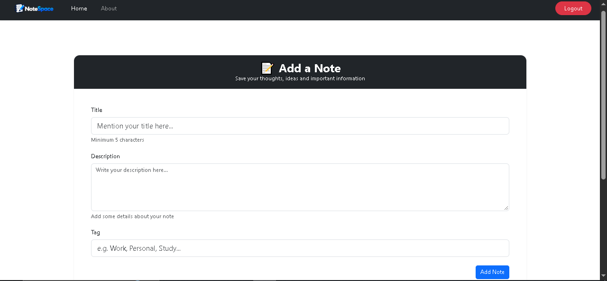
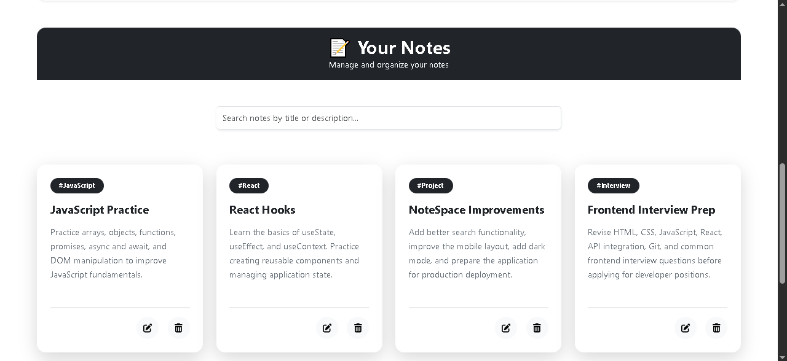
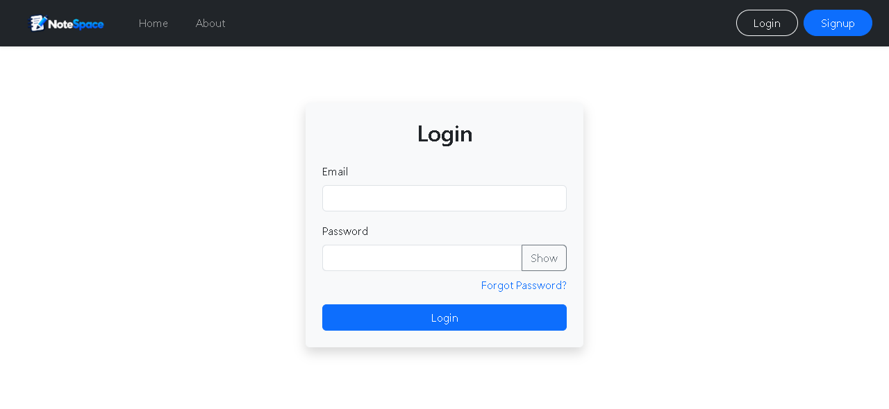
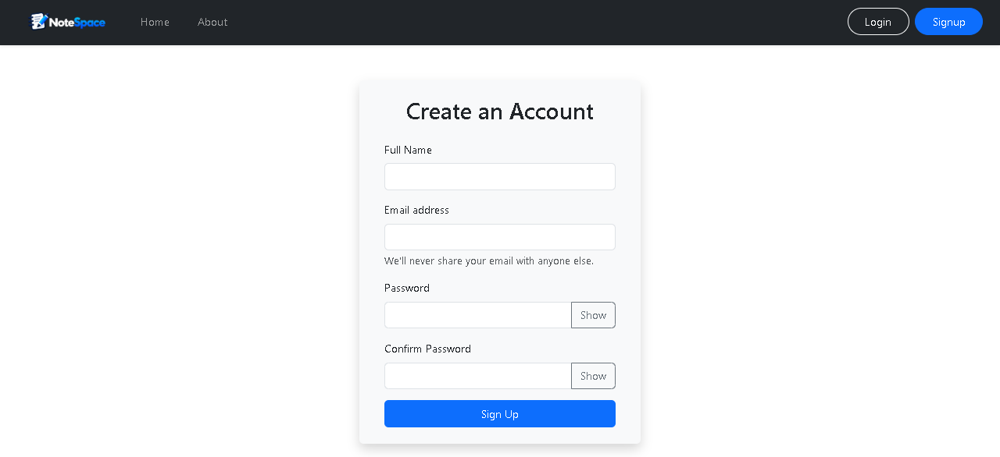
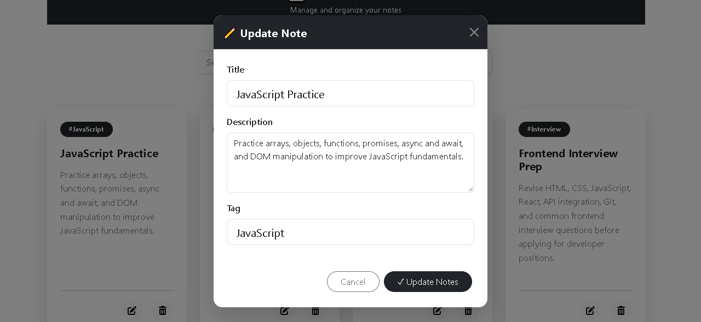
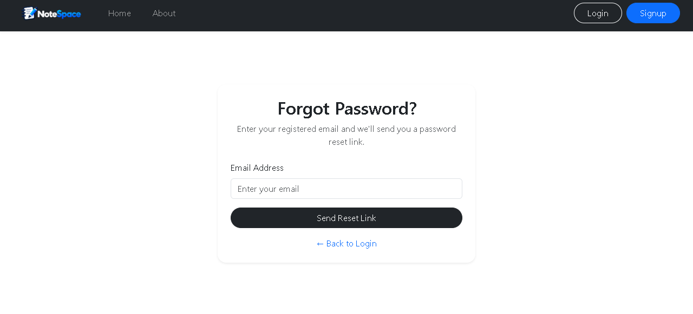
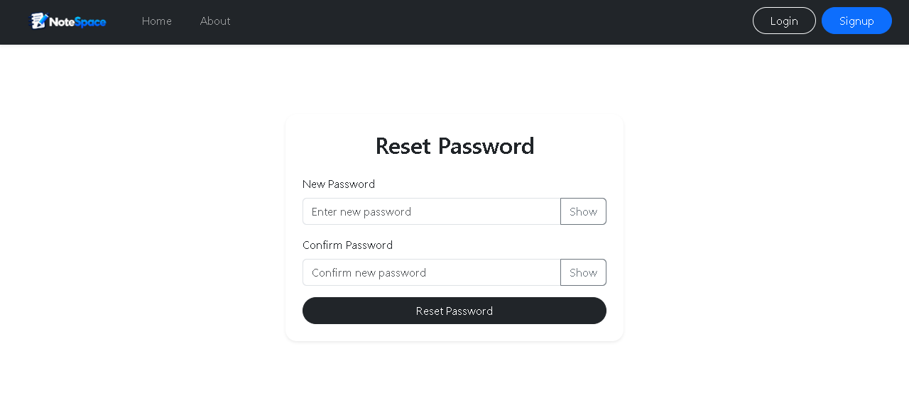

#📝 NoteSpace

NoteSpace is a full-stack note management web application that allows users to securely create, manage, search, edit, and delete their personal notes.

The application includes JWT-based authentication, password reset functionality through email, form validation, protected APIs, and a responsive Bootstrap interface.

##🚀 Project Overview

NoteSpace provides a simple and secure platform for managing personal notes.

Users can:

- Create an account
- Login securely
- Create notes
- View their notes
- Search notes
- Edit existing notes
- Delete notes with confirmation
- Reset their password through email
- Logout securely

Each user's notes are protected using JWT authentication, ensuring users can access and modify only their own notes.

##✨ Features

###🔐 Authentication

- User registration
- User login/logout
- JWT authentication
- Protected routes and APIs
- Password hashing using bcrypt
- JWT token expiration
- Session expiration handling

###📝 Note Management

- Add new notes
- View all personal notes
- Edit notes
- Delete notes
- Delete confirmation modal
- Search notes by title or description
- Tag support

###🔑 Password Management

- Forgot password functionality
- Password reset through email
- Secure reset token generation
- Reset token expiration
- Password confirmation validation
- Show/hide password functionality

###🎨 User Interface

- Responsive design
- Bootstrap 5 styling
- Loading states
- Success and error alerts
- Responsive navigation bar
- Clean note cards
- Mobile-friendly interface

##🛠️ Tech Stack

###Frontend

- React.js
- React Router
- Context API
- Bootstrap 5
- JavaScript
- HTML5
- CSS3

###Backend

- Node.js
- Express.js
- MongoDB
- Mongoose
- JWT
- bcryptjs
- Express Validator
- Nodemailer
- CORS

###Development Tools

- Git
- GitHub
- npm
- Nodemon

##📂 Project Structure

```text
NoteSpace/
│
├── Backend/
│   ├── middleware/
│   │   └── fetchuser.js
│   │
│   ├── models/
│   │   ├── Notes.js
│   │   └── User.js
│   │
│   ├── routes/
│   │   ├── auth.js
│   │   └── notes.js
│   │
│   ├── db.js
│   ├── index.js
│   └── .env
│
├── public/
│   ├── index.html
│   ├── nav.png
│   └── logo-note.png
│
├── src/
│   ├── components/
│   │   ├── About.js
│   │   ├── Addnote.js
│   │   ├── Alert.js
│   │   ├── ForgotPassword.js
│   │   ├── Home.js
│   │   ├── Login.js
│   │   ├── Navbar.js
│   │   ├── Noteitem.js
│   │   ├── Notes.js
│   │   ├── ResetPassword.js
│   │   └── Signup.js
│   │
│   ├── context/
│   │   └── notes/
│   │       ├── NoteState.js
│   │       └── noteContext.js
│   │
│   ├── App.js
│   ├── index.js
│   └── index.css
│
├── .gitignore
├── package.json
└── README.md

⚙️ Installation & Setup

1. Clone the repository
   git clone https://github.com/saurabh-2414/NoteSpace.git

2. Navigate to the project
   cd NoteSpace

3. Install frontend dependencies
   npm install

4. Install backend dependencies
   cd Backend
   npm install
   cd ..

5. Configure environment variables
   Create a .env file in the project root for the React frontend:

REACT_APP_API_URL=http://localhost:5000

Create a .env file inside the Backend folder:

- MONGO_URI=your_mongodb_connection_string
- JWT_SECRET=your_jwt_secret
- EMAIL_USER=your_email
- EMAIL_PASSWORD=your_gmail_app_password
- FRONTEND_URL=http://localhost:3000

- Never commit .env files or expose database credentials, JWT secrets, or email app passwords.

6. Start the backend

- From the project root: nodemon Backend/index.js

- The backend will run on: http://localhost:5000

7. Start the frontend

- In another terminal: npm start

- The frontend will run on: http://localhost:3000

🔐 Environment Variables

Frontend

- Variable	                  Description
- REACT_APP_API_URL	        Backend API URL

Example:

- REACT_APP_API_URL=http://localhost:5000

Backend

- Variable	                      Description
- MONGO_URI                   MongoDB connection string
- JWT_SECRET                  Secret used to sign JWT tokens
- EMAIL_USER	               Email address used for password reset
- EMAIL_PASSWORD	            Gmail App Password
- FRONTEND_URL      	         Frontend URL used in password reset links

🔌 API Information

- Authentication APIs
- Method	             Endpoint	                        Description
- POST	        /api/auth/createuser	            Register a new user
- POST	        /api/auth/login                  	Login user
- POST	        /api/auth/forgotpassword	         Request password reset
- POST        	  /api/auth/resetpassword/:token  	Reset password
- GET	           /api/auth/getuser                	Get authenticated user

- Notes APIs
- Method	          Endpoint	                        Description
- GET	          /api/notes/fetchallnotes	         Fetch user's notes
- POST	       /api/notes/addnote              	Create a new note
- PUT	          /api/notes/updatenote/:id        	Update a note
- DELETE	       /api/notes/deletenote/:id        	Delete a note

- Protected APIs require the JWT token in the request header:

- auth-token: <your-jwt-token>

📸 Screenshots

- Home / Notes




- Login



- Signup



- Edit / Update Note



- Forgot Password



- Reset Password



🔒 Security

- NoteSpace implements several security practices:

- Passwords are hashed using bcrypt
- JWT authentication is used for protected APIs
- Users can access only their own notes
- Password reset tokens expire
- Sensitive environment variables are excluded from Git
- Generic responses are used for password reset requests
- Protected backend routes require authentication

🔮 Future Improvements

Possible future improvements include:

- Dark mode
- Pagination for notes
- Note sorting and filtering
- Rich text editor
- Note categories
- Pin important notes
- Archive notes
- Profile management
- Better search functionality
- Cloud deployment
- Automated testing
- Rate limiting
- Refresh token authentication

👨‍💻 Author

Saurabh Prajapati

GitHub:
https://github.com/saurabh-2414

📄 License

This project is created for learning and portfolio purposes.
